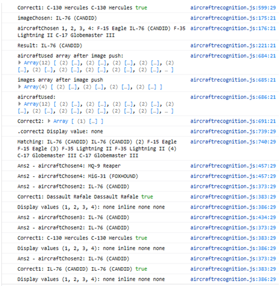

<h1 align="center">Military Aircraft Recognition quiz website</h1>

[View the live project here.](https://thirdelement.github.io/militaryaircraftrecognition/)

This is a website for a military aircraft recognition quiz.  It is designed for participation on a range of devices including desktop PCs, tablets and mobile phones.

## User Experience (UX)

The website has been created for military aircraft enthusiasts and those looking to improve their recognition skills.  The quiz comprises ten questions each asking the participant to select the correct name from a list of alternatives for the aircraft pictured.

The quiz currently includes a question bank of twenty aircraft across a variety of types such as fighter, bomber and transport.  This can be further developed with separate quizzes for specific aircraft types and an increase in the number of aircraft or answer options in each quiz.  These options would increase the difficulty, likelihood of return visits by participants and enable configuration of beginner, intermediate and expert levels.  

Further development could include provision of aircraft specification and visual description details on revealing an answer.  There is also scope to provide details on aircraft recognition history, methods and links to additional resources.  Please see the wireframe links for how this might be done.

-   ### User stories

    -   #### First Time Visitor Goals

        1. As a First Time Visitor, I want to do the quiz to test my knowledge.
        2. As a First Time Visitor, I want to do the quiz to see how fun it is.
        3. As a First Time Visitor, I want to do the quiz to see how informative it is.
        4. As a First Time Visitor, I want to do the quiz to check out the aircraft.

    -   #### Returning Visitor Goals

        1. As a Returning Visitor, I want to do the quiz to improve my score.
        2. As a Returning Visitor, I want to do the quiz to check out a different aircraft type.
        3. As a Returning Visitor, I want to do the quiz to challenge my friends.
        4. As a Returning Visitor, I want to move from Beginner to Expert levels.

    -   #### Frequent User Goals
        1. As a Frequent User, I want to do the quiz to improve my knowledge.
        2. As a Frequent User, I am interested in the WEFT descriptions in the answers.
        3. As a Frequent User, I want to do the quiz to challenge my friends.

-   ### Design
    -   #### Colour Scheme
        -   The colours are shades of blue in order to resemble the sky as the natural environment for these aircraft.
        -   From research into the psychology of colour, blue is often claimed to evoke feelings of calmness, reliability and assurance (see https://www.verywellmind.com/the-color-psychology-of-blue-2795815).   In this way, it has also been used to influence the participant’s view of the quiz as a quality product.
            <h2 align="left"></h2>
        -   The navbar is a darker blue in order to be distinct from the rest of the web page.  The navbar text and headings used in the body are yellow which is clear and contrasts well.
            <h2 align="left"></h2>
        -   Grey has been used more immediately around the answer buttons and headings to provide a contrast with the blue and aesthetic value.  The grey also matches the colour of most of the aircraft and so is appropriate.  Grey is often associated with technology (see https://coschedule.com/blog/color-psychology-marketing/#secondary) and so is also suitable for this reason.
        -   The answer, start and next buttons are white so as to be seen but not overly distracting.  On hover the answer buttons change to an orange/yellow similar to the Bootstrap ‘bg-warning’ colour and Next button to a dark red.  These provide distinct visual feedback for the user.
            <h2 align="left"></h2>
            <h2 align="left"></h2>
        -   The progress bar uses the same red as the Next button.  This is used so the progress stands out and there is some matching with other site elements.
            <h2 align="left"></h2>
        -   The contact form features a grey background, yellow heading, white text and confirmation Bootstrap ‘toast’ component with ‘bg-warning’  background colour.  The confirmation is brightly coloured and positioned above the form to be clearly seen whatever device is being used.  It is configured to fade after a few seconds if not manually closed.
            <h2 align="left"></h2>

    -   #### Typography
        -   The focus of effort for this project has been on site functionality, presentation of images and layout.  Due to time constraints, it has been considered that default fonts would suffice.
        -   As mentioned in the colour scheme section above, the font colour has been modified where considered appropriate.
              
    -   #### Imagery
        -   The highest quality images have been selected within the limitations of using only images categorised as using ‘Creative Commons licensing'.  The images are the main focus for the quiz, add interest and challenge.  It was deemed important to ensure these were the best possible. 
        -   It was also considered crucial to keep the image proportions in order to realistically portray an aircraft’s size, shape and to aid recognition.  The image scale has been minimally altered in order to retain realistic aircraft dimensions.  However, the image height has been fixed in order to achieve a consistent viewing experience across standard Bootstrap breakpoints.
   
*   ### Wireframes 

    -   Desktop and mobile wireframes - [View](https://github.com/thirdelement/militaryaircraftrecognition/blob/master/military-aircraft-recognition-quiz_wireframes.pdf)
    -   These show mock-ups for the existing quiz site and with additional features such as a drop-down menu for different quiz types and difficulty level on the start page.  
    -   ‘Desktop – FAQ’ shows the navbar including a FAQ menu option with general aircraft recognition details and where to find more information.
    -   The Expert level screens feature a greater number of aircraft from which to choose.  However, the difficulty would also be increased with a quiz for a specific aircraft types or images from more challenging angles.  The slides show a text description of the aircraft once the answer is revealed with a link that could go to the Wikipedia page for that aircraft.
    -   Due to time constraints the beginner version of the quiz has been created without the FAQ, text description and Expert options.

## Features

-   Responsive on all device sizes tested.
    - Media queries have been used to display the aircraft image and buttons within the viewport without scrolling for both mobile portrait and landscape.  The iPhone 5 is the only exception tested where some scrolling in landscape view is required.
      <h2 align="left"></h2>
      <h2 align="left"></h2>

-   A fully interactive aircraft recognition quiz including:
    - Ten aircraft image recognition questions.
    - Four answer alternatives for each question.
    - Reveal of the correct answer before moving to the next question.
    - A progress bar showing the current question number and total.
    - A score displayed after the tenth question and an option to start over.
    - Random selection of questions and answers make it unlikely a participant will do the same quiz twice.
    - An image bank of twenty aircraft.

-   The website includes the following additional interactive elements::
    - Contact form including on-screen and email confirmation to sender email address and clearing of form fields when successfully sent.
    - Navbar menu options.

## Technologies Used

### Languages Used

-   [HTML5](https://en.wikipedia.org/wiki/HTML5)
-   [CSS3](https://en.wikipedia.org/wiki/Cascading_Style_Sheets)
-   [Javascript](https://en.wikipedia.org/wiki/JavaScript)

### Frameworks, Libraries & Programs Used

1. [Bootstrap 5.0:](https://getbootstrap.com/docs/5.0/getting-started/introduction/)
    - Bootstrap was used to assist with the responsiveness and styling of the website.
1. [Font Awesome:](https://fontawesome.com/)
    - Font Awesome was used for the check and cross mark icons used to show correct and incorrect answers.
1. [jQuery:](https://jquery.com/)
    - jQuery was used throughout to simplify the code.
1. [JavaScript:](https://en.wikipedia.org/wiki/JavaScript)
    - Javascript was used throughout in order to create an interactive and responsive quiz and contact form.  
1. [GitPod](https://gitpod.io/)
    - GitPod was used for code editing, version control, committing and pushing to GitHub.
1. [GitHub:](https://github.com/)
    - GitHub was used to store and manage project code pushed from GitPod.
1. [Irfanview:](https://www.irfanview.com/)
    - Irfanview was used to resize, edit and add filters to images.
1. [Balsamiq:](https://balsamiq.com/)
    - Balsamiq was used for [wireframes](https://github.com/thirdelement/militaryaircraftrecognition/blob/master/military-aircraft-recognition-quiz_wireframes.pdf) created during the design process. 

## Testing

JSHint, W3C Markup Validation Service and CSS Validation Service were used to validate all project pages ensuring no syntax errors are present.

### Testing User Stories from User Experience (UX) Section

-   #### First Time Visitor Goals

    1. As a First Time Visitor, I want to do the quiz to test my knowledge.
        1. Aircraft images have been selected to be challenging to aircraft recognition enthusiasts but accessible for beginners.
        2. A score is provided at the end of the quiz to provide feedback on knowledge.
        3. All aircraft are currently in service with national militaries.

    2. As a First Time Visitor, I want to do the quiz to see how fun it is.
        1. The emphasis for creating the quiz has been to provide a resource that is genuinely useful for those looking to improve their aircraft recognition skills.
        2. The focus of effort in building the quiz has been on the quality of imagery and usability.  The intention is that if the quality of the quiz is satisfactory then it will be fun for those interested in aircraft recognition to test their knowledge.
        3. The scores at the end of the test are provided with fun motivational comments and an image of an aircraft formation for the number of points achieved. 
        4. All image and button selections are randomized and so each testing experience will be different.  Although the existing image bank is limited to twenty aircraft this can be easily extended.

    3. As a First Time Visitor, I want to do the quiz to see how informative it is.
        1. Large, clear aircraft images have been used so the participant can notice the salient features of each aircraft.
        2. The quiz is a useful way to compare aircraft types across different militaries.
        3. The quiz is likely to pique the interest of participants keen on military aviation.  It is challenging enough to stretch the knowledge of the more expert aircraft observers.
        4. A description of the aircraft based on wings, engines, fuselage and tail (WEFT) recognition factors is not provided with the current quiz.  WEFT is a widely used system to assist in describing aircraft visual characteristics and recognition.  This would increase the informative value of the quiz and can be included as a future development.
        5. The FAQ as shown in the Wireframes can also be added in a future version.

    4. As a First Time Visitor, I want to do the quiz to check out the aircraft.
        1. There is emphasis on large clear aircraft photos.
        2. The main point of interest is the aircraft so clear, high quality images have been selected which have been made the predominant feature on each page.
        3. Due to copyright restrictions, the quiz has been restricted to ‘Creative Commons licence’ images only.

-   #### Returning Visitor Goals

    1. As a Returning Visitor, I want to do the quiz to improve my score.
        1. The participant’s score is shown at the end of the quiz.  Some words of encouragement are also provided depending on the score.  It is intended these will motivate participants to go again and improve their score.  
        2. Due to the randomised nature of images and buttons, although the same aircraft image is likely to appear in successive quiz attempts the answer options will be different.  Therefore, the maximum opportunity and value is taken to increase interest, learning and frequency of attempts.
        3. As mentioned previously, there are several features for future development that would keep visitors returning.  These include different levels of difficulty, increased bank of aircraft images, WEFT descriptions, FAQ and resource links. 
        4. The inclusion of a Hint button in future versions would also be useful to encourage more learning and accessibility of the quiz.  
        5. A further development would be to hold the score in session or local storage so the participant can use this as a target to beat.  

    2. As a Returning Visitor, I want to do the quiz to check out a different aircraft type.
        1. This quiz is focused on aircraft currently active in national militaries.  Therefore, the quiz is effective at improving recognition skills for these active aircraft only. There are many wonderful aircraft now retired from service that are not included.
        2. The current quiz version contains a mix of aircraft types which is useful for comparison purposes.  Future iterations can include separate quizzes for specific types in order to test and embed knowledge.

    3. As a Returning Visitor, I want to do the quiz to challenge my friends.
        1. The quiz is quick to complete and provide a score that can be shared with friends who are present physically.
        2. Sharing links for social media can be easily added to the results page.

    4. As a Returning Visitor, I want to move from Beginner to Expert levels.
        1. There are other military aviation quizzes available; however, these tend to provide same questions and answers on successive attempts.  This quiz will keep participants’ interest significantly longer due to the built-in randomisation. 
        2. Once additional difficulty levels and features are added this quiz will truly offer an experience above and beyond other military aircraft recognition quizzes.  

-   #### Frequent User Goals

    1. As a Frequent User, I want to do the quiz to improve my knowledge.
        1. The quiz is designed to start easy, encourage the participant to improve their scores and progress through the levels. 
        2. The existing beginner level caters to those wanting a brief short diversion and dip into the world of aircraft recognition.  Further features are planned so that participants can become curious about the aircraft themselves, research using the information and links provided and continue their quiz journey to Expert level and beyond.  

    2. As a Frequent User, I am interested in the WEFT descriptions in the answers.
        1. WEFT is a widely used method of identifying and describing aircraft.  Due to time constraints, a WEFT description will be provided in future quiz iterations only.

    3. As a Frequent User, I want to do the quiz to challenge my friends.
        1. Please see answer in Returning Visitor Goals.

### Further Testing

-   The website was tested on Google Chrome, Microsoft Edge, Microsoft Internet Explorer, Mozilla Firefox and Safari browsers.
-   The website viewing experience and functionality was checked on devices including Desktop, laptop, tablet, iPad, iPhone X, iPhone SE and Samsung S10e.  A broader range of simulated devices were used using the Google Developer features and Responsinator.com website.
-   Thorough testing of features and links were completed by the developer, friends, family and professional associates.

### Known Bugs

-   Testing has been undertaken to remove any known bugs.  Currently, I am not aware of any outstanding bugs not resolved or for which workarounds not yet been implemented. 
-   The bugs and development issues fixed have included the following:
    - Comparing arrays
        - The initial plan for this quiz was that images and buttons should be randomised.  Whilst a set number of questions that don’t change would probably have fulfilled the project brief this would make for a less interesting quiz and retain no interest for returning users. 
        - In order to achieve this, a two-dimensional array called ‘aircraft’ was implemented and aircraft added with a name and image for each.  A random selection was made using code from a Stack Overflow article here: https://stackoverflow.com/questions/14422233/how-do-you-select-a-random-variable-within-a-function-in-javascript.  
        - Each time an aircraft is randomly selected, it is pushed to another array called ‘images’.  The aircraft is then removed from the existing array using the splice method.
        - Once four selections are made these are added to answer buttons using jQuery.  The same random select is done from the ‘images’ array to choose which image is used as the correct answer. 
        - If the aircraft on the answer button clicked by the participant matches the aircraft in the image displayed then a checkmark is displayed and score incremented. 
        - The correct answer is then pushed to another array ‘aircraftUsed’.  This is compared to ‘aircraft’ and the difference added to the ‘aircraftAvailable’ array.  It is this array that is used for all subsequent questions as it will not contain aircraft previously used as answers and so remove the chance of repetition.
        - The various arrays were monitored via console.log to check what aircraft were moving where and ensure the setup was correct.  The most problematic issue was comparing items in two arrays.  Several methods were investigated including using indexOf (see https://stackoverflow.com/questions/24943200/javascript-2d-array-indexof) and the filter function (see https://stackoverflow.com/questions/34901593/how-to-filter-an-array-from-all-elements-of-another-array).  In the end a hash table and function were used to generate a key out of ‘aircraftUsed’, filter ‘aircraft’ by checking the hash table and add items to ‘aircraftAvailable’ (see https://stackoverflow.com/questions/46998798/comparing-2d-arrays-finding-unique-items).  
    - Event handlers
        - Once all the arrays above were implemented there was an issue with the score incrementing more than once when a button was clicked.  As with the above issue, console.log was to check the arrays and ensure the buttons were matching the aircraft expected.
        - Several different methods were used to increment the score including Javascript with .innerHTML, jQuery and variations of these including using the index (see https://stackoverflow.com/questions/46923549/need-to-increment-score-in-jquery-how-do-i-change-the-text), .one(), attr() to disable the attribute and adding if conditions to ensure the score is incremented only if these are met.  Research was done into the use of Google Diagnostics for more specific troubleshooting information beyond console.log (see https://medium.datadriveninvestor.com/stopping-using-console-log-and-start-using-your-browsers-debugger-62bc893d93ff).  
        - The diagnostics helped to go through the code step-by-step but the behaviour remained a mystery.  There appeared to be no pattern except the browser retained aircraft used in previous questions which could not be picked up by console.log or added to session or local storage.  I attempted moving the correct answer and selected answer to a different array and compare array values and the behaviour still occurred.  In the screenshot below there are three different values claiming to be in the same array which are not.  The screenshot also shows there are three different ‘Correct1:’ answers from the same button click.   
          <h2 align="left"></h2>
        - Finally, I asked a question on Stack Overflow (see https://stackoverflow.com/questions/66413208/how-can-i-stop-an-if-condition-comparing-two-array-items-from-being-met-by-pre).  The question was answered explaining that the click event handlers associated to the buttons were firing previous handlers.  The resolution was to add the jQuery .off() method immediately prior to .on() or one() in order to remove previous handlers.
    - Global variables
        - There was a requirement to keep the ‘aircraftUsed’ array out of the function so that the contents did not refresh each time the function was run.  Early iterations of the quiz achieved this by having one function nested inside another.  The outer function was called by a Start button which had to be clicked prior to clicking a Next button to move to subsequent questions.  This allowed the array to accumulate items as the quiz progressed.  Later in the development it became clear this Start button was needlessly complicating the user experience and the original wireframes only showed one button.
        - In order to avoid the use of global variables I investigated alternatives such as calling a function from inside another (see https://stackoverflow.com/questions/13218472/calling-a-function-defined-inside-another-function-in-javascript ), and returning an array with one function and calling it with another (see https://stackoverflow.com/questions/22270838/making-variables-available-outside-a-function-without-globals) , however, could not get these to work.
        - Therefore, I referred to the Code Institute module on Local Storage in order to configure Session Storage.  As Session Storage can only store strings, it was necessary to convert the array using JSON.stringify() to save and then back again using JSON.parse() to read (see https://stackoverflow.com/questions/52409418/pushing-an-element-to-an-existing-array-stored-in-session-storage and https://stackoverflow.com/questions/22120347/creating-an-array-and-storing-it-in-sessionstorage-with-javascript).  Testing appeared to show the Session Storage array being refreshed as was the issue previously.  In order to resolve this two Session Storage arrays were created of which one (‘aircraftSession1’) was updated with the answer for each question round.  The concat() method was then used to append this answer to a second array (‘aircraftSession’).  This second array was then used as a comparison with the ‘aircraft’ array in order to create the ‘aircraftAvailable’ array which resolved the issue.

## Deployment

### GitHub Pages

The project was deployed to GitHub pages using the below procedure:

1.	Log into GitHub, click on Repositories and select the [militaryaircraftrecognition repository](https://github.com/thirdelement/militaryaircraftrecognition). 
2.	Click Settings.
3.	In GitHub Pages, Source, select the Branch as Master and click Save.
4.	The page will refresh and the published site [link](https://thirdelement.github.io/militaryaircraftrecognition/) will then appear in GitHub Pages.

### Forking the GitHub Repository

We can make a copy of the original repository on our GitHub account by forking the GitHub Repository to view and/or make changes without affecting the original repository by using the following steps:

1.	Log in to GitHub and locate the [militaryaircraftrecognition repository](https://github.com/thirdelement/militaryaircraftrecognition). 
2.	At the top of the Repository (not top of page) just above the "Settings" Button on the menu, locate the "Fork" Button.
3.	You should now have a copy of the original repository in your GitHub account.

### Making a Local Clone

1.	Log in to GitHub and locate the [militaryaircraftrecognition repository](https://github.com/thirdelement/militaryaircraftrecognition). 
2.	Under the repository name, click "Clone or download".
3.	To clone the repository using HTTPS, under "Clone with HTTPS", copy the link.
4.	Open Git Bash
5.	Change the current working directory to the location where you want the cloned directory to be made.
6.	Type git clone, and then paste the URL you copied in Step 3.

    $ git clone https://github.com/thirdelement/militaryaircraftrecognition

7.	Press Enter. Your local clone will be created.

Please see this [link](https://docs.github.com/en/github/creating-cloning-and-archiving-repositories/cloning-a-repository#cloning-a-repository-to-github-desktop) for more detailed explanation.

## Credits

### Code

-   [Bootstrap 5.0](https://getbootstrap.com/docs/5.0/getting-started/introduction/): Bootstrap 5.0 was used throughout the site so that it is responsive to different devices and viewport sizes.

-   Code was used from external sources in the following instances:
    - [Add a Bootstrap toast component ](https://getbootstrap.com/docs/5.0/components/toasts/)
    - [Implementation of the toast component on sendEmail.js ](https://rubysrivastava.github.io/exploregothenburg/contact.html)
    - [Implementation of Bootstrap progress bar ](https://www.youtube.com/watch?v=QxQRtwAtqKE)
    - [Removal of repeated tags in an array ](https://stackoverflow.com/questions/66413208/how-can-i-stop-an-if-condition-comparing-two-array-items-from-being-met-by-pre)
    - [Comparison of two arrays  ](https://stackoverflow.com/questions/46998798/comparing-2d-arrays-finding-unique-items)
    - [Randomly select from an array  ](https://stackoverflow.com/questions/14422233/how-do-you-select-a-random-variable-within-a-function-in-javascript)
    - [Remove item from an array  ](https://stackoverflow.com/questions/57059564/how-to-exclude-an-array-element-from-a-random-pick)
    - [Storing an array in Session Storage  ](https://stackoverflow.com/questions/52409418/pushing-an-element-to-an-existing-array-stored-in-session-storage)
    - [Removing event handlers  ](https://stackoverflow.com/questions/66413208/how-can-i-stop-an-if-condition-comparing-two-array-items-from-being-met-by-pre)
    - [Remove Favicon.ico 404 console error  ](https://stackoverflow.com/questions/39149846/why-am-i-seeing-a-404-not-found-error-failed-to-load-favicon-ico-when-not-usin)

### Content

-   All content was written by the developer apart from the instances of external source use mentioned above.

### Media

-   The aircraft images for the quiz answers were found via a Google search for images with ‘Creative Commons licences’ only.   These are from mostly popular sites such as Wikipedia, Flickr and specific locations can be provided on request.
-   The aircraft formation images displayed with presentation of quiz scores were all sourced from https://unsplash.com/.   

### Acknowledgements

-   My mentor for helpful advice and support.
